# 📜 Policy as Code (PaC)

## What is Policy as Code?

The idea of treating policy as code / config / rules that can be evaluated by tools to make runtime decisions. Generally, policy as code approach reduces **_cost of compliance_** by automating grunt work required to audit for policy violations.

## Why use Policy as Code?

Manual verification and approval of new software components is, to put it simply, tedious, contentious, error prone and incomplete. It is not possible to manually analyses a 3rd party dependency and its transitive dependencies. We believe organizational software supply chain policies should be codified so that tools can be build to automatically evaluate every 3rd party artifact for compliance against policies.

Examples of software supply chain policy may include:

- Dependencies must not have known critical vulnerabilities
- Dependencies must be maintained
- Dependencies must not be new / must have an extensive user base
- Publishers must follow security standards e.g. [SLSA](https://slsa.dev/)

## Filter Suite

```mermaid
flowchart LR
    subgraph "Policy"
        A["👥 Security Team"] -->|Define| B[["Policy Rules"]]
        B -->|Convert to| C[["Filter Suite"]]
    end

    subgraph "Evaluation"
        D["👤 Developer"] -->|Add| E[["OSS Component"]]
        E -->|Scan| F[["vet"]]
        F -->|Check| C
        C -->|Match| G[("❌ Blocked")]
        C -->|No Match| H[("✅ Allowed")]
    end

    %% Theme-aware styling
    style G fill:transparent,stroke:#fa5252,stroke-width:2px
    style H fill:transparent,stroke:#40c057,stroke-width:2px


```



A single filter is useful for identification of packages that meet some specific criteria. While it helps solve various use-cases, it is not entirely suitable for `security guardrails` where multiple filters may be required to express an organization's acceptable OSS usage policy.

- For example, an organization may define a filter to deny certain type of packages

  1. Any package that has a high or critical vulnerability
  2. Any package that does not match acceptable OSS licenses
  3. Any package that has a low [OpenSSF scorecard score](https://github.com/ossf/scorecard)

- To express this policy, multiple filters are needed such as

```bash
vulns.critical.exists(p, true) ||
licenses.exists(p, (p != "MIT") && (p != "Apache-2.0")) ||
(scorecard.scores.Maintained == 0)
```

- To solve this problem, we introduce the concept of `Filter Suite`. It can be represented as an YAML file containing multiple filters to match:

```yaml
name: Generic Filter Suite
description: Example filter suite with canned filters
filters:
  - name: critical-vuln
    value: |
      vulns.critical.exists(p, true)
  - name: safe-licenses
    value: |
      licenses.exists(p, (p != "MIT") && (p != "Apache-2.0"))
  - name: ossf-maintained
    value: |
      scorecard.scores.Maintained == 0
```

- A scan or query operation can be invoked using the filter suite:

```bash
vet scan -D /path/to/repo --filter-suite /path/to/filters.yml --filter-fail
```

- The filter suite will be evaluated as
  - Ordered list of filters as given in the suite file
  - Stop on first rule match for a given package
