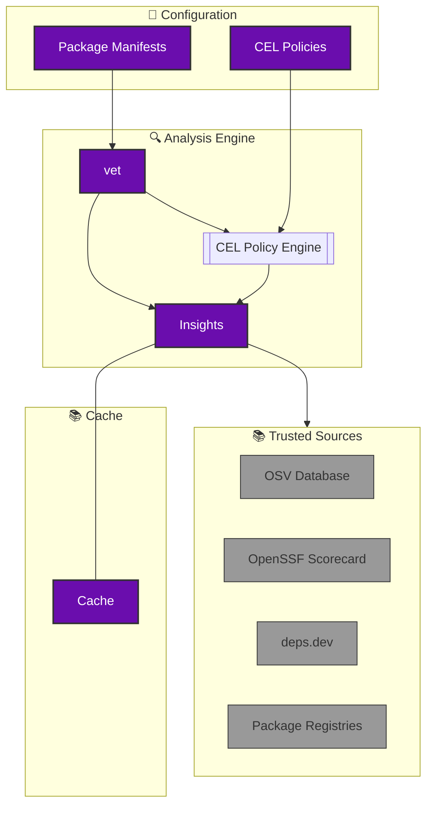

## About vet

[vet](https://github.com/safedep/vet) is a free and open source tool for identifying risks in open source software supply chain. It helps security engineering teams to establish policy driven guard rails against risky OSS components.

Vet automates the analysis of open source dependencies by combining insights from trusted sources and allowing developers to enforce custom security policies using CEL.

### 🤩 vet in Action

    

## About SafeDep Cloud

SafeDep Cloud is a managed SaaS built using [SafeDep Control Tower](https://docs.safedep.io/cloud). It is meant for large scale `vet` deployments across 1000+ repositories, central policy management, integrated SBOM visualization, querying and other governance use-cases. See [cloud quickstart guide](/cloud/quickstart) for more details.
